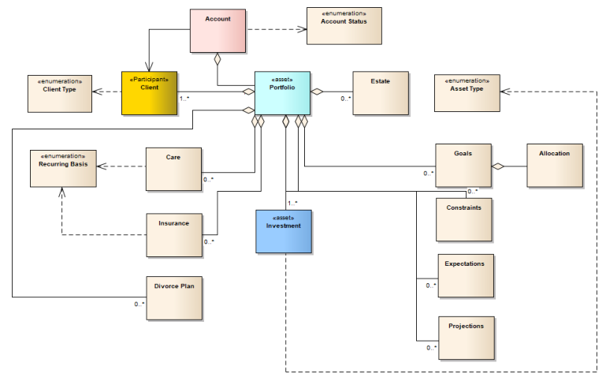
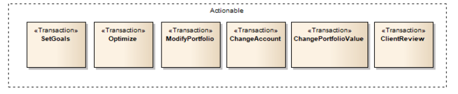
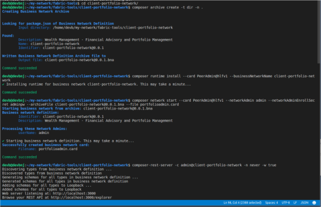
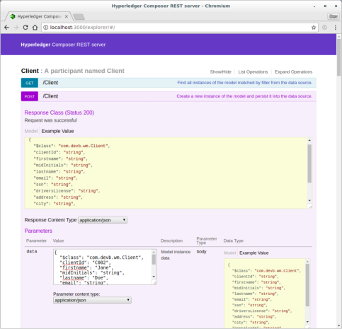
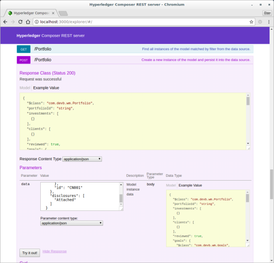

# Financial Planning (Wealth Management)
### Using Hyperledger Composer and Fabric

Wealth Management is an evolved style of management that requires experienced financial planning. As Harold Evensky cites in his book on Wealth Management, it is a specialty of Financial Planning. The Wealth Management machinery needs to know the client well – his or her dreams, goals and fears.

In doing so, it is necessary to:
* Gather data, aggregate information
* Set goals (identify constraints, fears, financial and non-financial issues)
* Prepare alternatives
* Recommend and assemble the portfolio
* Implement using Blockchain technology
* Periodically review the plan and portfolio 

Power of blockchain lies in its ability to transfer assets and maintain an immutable history of such transactions. Distributed ledger technology, a critical component of blockchain fits the needs of a person who purports a portfolio of all his or her financial assets. As newer assets become added or revised, the ledger system maintains and manages the financial portfolio within the client’s goals and constraints.

Hyperledger financial portfolio advisory provides practical advice for protecting assets as part of any comprehensive wealth management plan. It contains provisions to coordinate asset protection strategy with the client’s estate, investment management, retirement and business plans.

The result is an effective strategy that keeps the financial planning on track, protects the assets from physical and legal risks with historical data, and enables client to weather financial surprises.

The blockchain Hyperledger Composer business application like others contain:

* Model (com.devb.wm.cto)
* Namespace com.devb.wm.cto
* Functions (logic.js)
* Access control (access.acl)
* Tests (and examples)

All bundled as an archive – client-portfolio-network.

#### The com.devb.wm.cto Model

#### Transactions and events

Note - We acknowledge the the diagram breaks the UML conventions.

### Running the Financial Planning system
To run the system, we assume you have Hyperledger Composer running on Docker locally. Please also unarchive the files in [client-portfolio]

<pre>
// get from github
$ curl -LJO https://github.com/snoborder/financial-planning/archive/master.zip
// unzip the file and change to the financial planning folder

// create the composer archive
composer archive create -t dir -n .

// install composer runtime
composer runtime install --card PeerAdmin@hlfv1 --businessNetworkName client-portfolio-network

// deploy bna
composer network start --card PeerAdmin@hlfv1 --networkAdmin admin --networkAdminEnrollSecret adminpw --archiveFile client-portfolio-network@0.0.1.bna --file portfolioadmin.card

// import the useful networkadmin card
composer card import --file portfolioadmin.card

// ping the network card
composer network ping --card admin@client-portfolio-network

// start the rest server
composer-rest-server
// give the name admin@client-portfolio-network

composer-rest-server -c admin@client-portfolio-network -n never -w true

You can now access the REST API services at localhost at port 3000. 
</pre>

### Hyperledger Composer REST SERVER
#### Up and running

You can use the client to create clients - C001, C002. Investments - BITC, ETHR. And, add them to the portfolio P001

Creating a client

CLI

$ composer participant add -c admin@client-portfolio-network -d ' 
{ "$class": "com.devb.wm.Client", "clientId": "C001",
    "firstname": "John",
    "midInitials": "",
    "lastname": "Doe",
    "email": "John.Doe@email.com",
    "ssn": "666778899",
    "driversLicense": "DL098654321",
    "address": "100 Enterprise Drive",
    "city": "Rockaway",
    "postalcode": "07866",
    "state": "NJ",
    "countryCode": "US"
  }'
  

Creating an investment

### Congratulations
